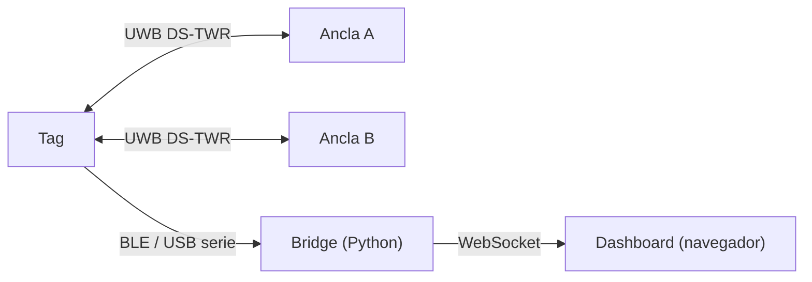

# UWB Indoor Positioning

Posicionamiento 2D en interiores con UWB: un punto sigue a una persona sobre el plano de la sala, en tiempo real, con 3 módulos Qorvo DWM3000 y 3 Arduino Nano 33 BLE.

> **Estado:** en desarrollo. El firmware compila y el software del Mac funciona sobre datos simulados. Las medidas con hardware real todavía no están hechas; esta página no da cifras de precisión hasta tenerlas.

## Cómo funciona

Dos anclas fijas en la misma pared y un tag móvil. Diez veces por segundo el tag mide su distancia a cada ancla por tiempo de vuelo (DS-TWR) y envía las dos distancias al Mac por BLE o USB. Un proceso en Python las filtra, calcula la posición por intersección de dos círculos y la publica por WebSocket a un dashboard en el navegador.



Con dos anclas hay dos posiciones posibles, simétricas respecto a la pared. Como la persona siempre está delante de la pared, el software se queda con esa.

## Probarlo sin hardware

```
make setup
make replay
```

`make replay` reproduce una sesión simulada y abre el dashboard. En un Mac con Apple Silicon, `make setup` avisa si falta Rosetta 2, que solo hace falta para compilar y grabar el firmware.

## Con hardware

| Paso | Comando |
| --- | --- |
| Registrar cada placa (conectada sola) | `tools/nodes.py register anchor_a` |
| Compilar los tres nodos | `make firmware` |
| Grabar un nodo | `make flash ROLE=tag` |
| Calibrar | ver [docs/calibracion.md](docs/calibracion.md) |
| Demo por BLE | `make demo` |
| Demo por USB | `make demo SERIAL=1` |

La geometría de la sala, las zonas y los parámetros del filtro están en [config.yaml](config.yaml).

### Cableado de cada nodo

| DWM3000 | Nano 33 BLE |
| --- | --- |
| VDD3V3 | 3.3V (nunca 5 V) |
| GND | GND |
| SPICLK | D13 |
| SPIMOSI | D11 |
| SPIMISO | D12 |
| SPICSn | D10 |
| IRQ | D2 |
| RSTn | D9 |
| WAKEUP | D8 |

Cables SPI de 5 cm o menos, y un condensador de 10 µF y otro de 100 nF junto a VDD.

## Estructura

| Carpeta | Contenido |
| --- | --- |
| `firmware/` | Proyecto Arduino único para los tres nodos; el rol se elige al compilar |
| `bridge/` | Receptor BLE y serie, filtro, posición, servidor WebSocket, tests |
| `dashboard/` | Una sola página HTML con Canvas, sin build |
| `tools/` | Instalación, simulador, calibración, registro de placas |
| `logs/` | Sesiones grabadas; incluye dos de ejemplo |
| `docs/` | Contrato de datos y calibración |

## Limitaciones conocidas

- Dos anclas: posición solo en el semiplano frente a la pared.
- Sin STS: el ranging no está autenticado.
- La altura del tag se supone constante.

## Licencia

MIT para el código de este repositorio. El driver DW3000 de Qorvo no se incluye: `make setup` lo descarga y conserva su propia licencia, que solo permite usarlo con chips de Qorvo.
