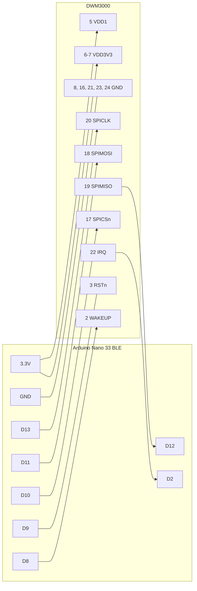

# Cableado y soldadura de un nodo

Cada nodo es un módulo Qorvo DWM3000 conectado por SPI a un Arduino Nano 33 BLE (o Nano 33 BLE Sense, que tiene el mismo pinout). Los cuatro nodos (anclas A, B, C y tag) se cablean exactamente igual: el rol lo decide el firmware.

Fuente del pinout del módulo: *DWM3000 Data Sheet* de Qorvo, revisión B (mayo de 2021), sección 3 y figura 11.

## Material por nodo

| Material | Cantidad | Nota |
| --- | --- | --- |
| DWM3000 | 1 | Módulo de 23 × 13 mm con 24 pads castellados de paso 1.4 mm |
| Arduino Nano 33 BLE | 1 | |
| Placa adaptadora (breakout) para DWM3000, o PCB perforada | 1 | Soldar cables directamente a los pads es frágil |
| Condensador cerámico 10 µF | 1 | Entre VDD3V3 y GND, lo más cerca posible del módulo |
| Condensador cerámico 100 nF | 1 | En paralelo con el de 10 µF |
| Cables dupont o hilo rígido | 11 | 5 cm o menos |

## 1. Pads del DWM3000

Vista desde arriba, con la antena cerámica en el extremo superior. Los pads 1 a 8 están en el lado izquierdo, del 9 al 16 en el borde inferior y del 17 al 24 en el lado derecho.

```
                 ┌───────────────────────────┐
                 │      ANTENA CERÁMICA      │   <- zona libre de metal
                 │                           │
     EXTON   1 ──┤                           ├── 24  GND
     WAKEUP  2 ──┤                           ├── 23  GND
     RSTn    3 ──┤                           ├── 22  IRQ / GPIO8
     GPIO7   4 ──┤          DWM3000          ├── 21  GND
     VDD1    5 ──┤        (vista desde       ├── 20  SPICLK
     VDD3V3  6 ──┤          arriba)          ├── 19  SPIMISO
     VDD3V3  7 ──┤                           ├── 18  SPIMOSI
     GND     8 ──┤                           ├── 17  SPICSn
                 └──┬───┬───┬───┬───┬───┬───┬───┬──┘
                    9  10  11  12  13  14  15  16

     Borde inferior, de izquierda a derecha:
      9 GPIO6   10 GPIO5   11 GPIO4   12 GPIO3
     13 GPIO2   14 GPIO1   15 GPIO0   16 GND
```

Así lo dibuja la figura 8 del datasheet. Antes de soldar, localiza el pad 1 en tu módulo (o la numeración de tu placa adaptadora) y comprueba que la orientación coincide.

| Pad | Señal | Tipo | Uso en este proyecto |
| --- | --- | --- | --- |
| 1 | EXTON | Salida | Sin conectar |
| 2 | WAKEUP | Entrada | **D8** del Nano |
| 3 | RSTn | Entrada/salida, open-drain | **D9** del Nano |
| 4 | GPIO7 / SYNC | E/S | Sin conectar |
| 5 | **VDD1** | Alimentación | **3.3V** del Nano |
| 6 | VDD3V3 | Alimentación | **3.3V** del Nano |
| 7 | VDD3V3 | Alimentación | **3.3V** del Nano |
| 8 | GND | Masa | **GND** del Nano |
| 9 | GPIO6 / SPIPHA | E/S | Sin conectar (su pull-down interno fija el modo SPI 0) |
| 10 | GPIO5 / SPIPOL | E/S | Sin conectar (ídem) |
| 11–15 | GPIO4 … GPIO0 | E/S | Sin conectar |
| 16 | GND | Masa | GND |
| 17 | SPICSn | Entrada | **D10** del Nano |
| 18 | SPIMOSI | Entrada | **D11** del Nano |
| 19 | SPIMISO | Salida | **D12** del Nano |
| 20 | SPICLK | Entrada | **D13** del Nano |
| 21 | GND | Masa | GND |
| 22 | IRQ / GPIO8 | Salida | **D2** del Nano |
| 23 | GND | Masa | GND |
| 24 | GND | Masa | GND |

Los cinco pads de masa (8, 16, 21, 23 y 24) se unen entre sí en la placa adaptadora. Si solo se usa un cable de masa hasta el Nano, que sea desde el pad 8, junto a la alimentación; mejor aún, dos cables (pad 8 y pad 21).

## 2. Pines del Nano 33 BLE

Vista desde arriba, con el conector USB arriba. Solo se usan los pines marcados con ◀.

```
                    ┌──[ USB ]──┐
   ▶ SPICLK   D13 ──┤           ├── D12  SPIMISO ◀
   ▶ 3V3     3.3V ──┤           ├── D11  SPIMOSI ◀
             AREF ──┤           ├── D10  SPICSn  ◀
               A0 ──┤           ├── D9   RSTn    ◀
               A1 ──┤           ├── D8   WAKEUP  ◀
               A2 ──┤           ├── D7
               A3 ──┤   Nano    ├── D6
               A4 ──┤  33 BLE   ├── D5
               A5 ──┤           ├── D4
               A6 ──┤           ├── D3
               A7 ──┤           ├── D2   IRQ     ◀
   ✗ NO USAR   +5V ──┤           ├── GND          ◀
            RESET ──┤           ├── RESET
   ▶ GND      GND ──┤           ├── RX0
              VIN ──┤           ├── TX1
                    └───────────┘
```

Los nombres de pin están serigrafiados en la placa: si esta figura y la serigrafía no coinciden, manda la serigrafía.

## 3. Conexiones

| # | Nano 33 BLE | DWM3000 (pad) | Señal |
| --- | --- | --- | --- |
| 1 | 3.3V | 5 | VDD1 |
| 2 | 3.3V | 6 y 7 | VDD3V3 |
| 3 | GND | 8 (y 16, 21, 23, 24 unidos) | GND |
| 4 | GND (el otro pin GND) | 21 | GND, segundo cable |
| 5 | D13 | 20 | SPICLK |
| 6 | D11 | 18 | SPIMOSI |
| 7 | D12 | 19 | SPIMISO |
| 8 | D10 | 17 | SPICSn |
| 9 | D2 | 22 | IRQ |
| 10 | D9 | 3 | RSTn |
| 11 | D8 | 2 | WAKEUP |



## 4. Reglas que no se pueden saltar

1. **Nunca 5 V.** Ni el pin +5V ni VIN del Nano van al módulo: el DWM3000 admite como máximo 3.6 V en alimentación y en cualquier pin digital. El Nano 33 BLE trabaja a 3.3 V, así que sus pines digitales ya son compatibles.
2. **VDD1 también a 3.3 V.** Alimenta la parte siempre encendida del chip. Sin ella el DW3000 no arranca y el firmware lee un DEV_ID incorrecto o no sale del reset.
3. **Condensadores junto al módulo.** 10 µF y 100 nF entre VDD3V3 (pads 6-7) y GND, a pocos milímetros de los pads. En transmisión el módulo consume unos 40 mA a golpes, y sin ellos el nodo puede reiniciarse.
4. **RSTn nunca a nivel alto desde fuera.** Es open-drain. El firmware lo lleva a nivel bajo para resetear y después lo deja como entrada. No le pongas pull-up externo ni lo conectes a 3.3V.
5. **Cables SPI de 5 cm o menos.** Después del arranque el SPI va a 8 MHz; con cables largos las lecturas se corrompen.
6. **Antena libre.** Nada de metal (cables, tornillos, powerbank, el propio Nano) a menos de 1 cm de la antena cerámica, ni encima ni debajo. El Nano va detrás o debajo del cuerpo del módulo, nunca junto a la antena. Si el adaptador tiene plano de masa, la antena debe sobresalir del borde de la placa, idealmente unos 10 mm.
7. **Pads 9 y 10 sin conectar.** Al arrancar, el chip lee SPIPHA y SPIPOL en esos pads. Sus pull-down internos seleccionan el modo SPI 0, que es el que usa el firmware; si se conectan a 3.3V el SPI deja de funcionar.

## 5. Orden de soldadura

1. Soldar el DWM3000 a la placa adaptadora: primero dos pads en esquinas opuestas para fijarlo, comprobar que todos los pads quedan alineados, y después el resto. Poco estaño y punta fina; revisar con lupa que no hay puentes entre pads vecinos (el paso es de 1.4 mm).
2. Unir en el adaptador los cinco pads de GND, y los pads 5, 6 y 7 a la línea de 3.3 V.
3. Soldar los condensadores de 10 µF y 100 nF entre 3.3 V y GND, pegados al módulo.
4. Soldar los 11 cables del apartado 3.
5. Etiquetar el nodo (A, B, C o TAG) y hacer una foto para `docs/hardware/`.

## 6. Comprobaciones antes de conectar el USB

Con un multímetro, con el nodo **sin alimentar**:

| Prueba | Resultado esperado |
| --- | --- |
| Continuidad entre 3.3V y GND | Sin cortocircuito (puede pitar un instante al cargar los condensadores) |
| Continuidad de cada cable del apartado 3, de pin a pad | Continuidad en los 11 |
| Continuidad entre pads vecinos del DWM3000 | Sin continuidad, salvo entre pads que estén unidos a propósito (GND con GND, 5-6-7 entre sí) |
| Continuidad entre +5V o VIN del Nano y cualquier pad del módulo | Sin continuidad |

Después, con el USB conectado:

| Prueba | Resultado esperado |
| --- | --- |
| Tensión entre pad 6 y pad 8 | 3.3 V (entre 3.2 y 3.4) |
| Tensión entre pad 5 y pad 8 | 3.3 V |
| Tras grabar el firmware (`make flash ROLE=tag`), comando `ID 100` por serie | `fallos=0` y `ultimo=0xDECA0302` |
| LED RGB del Nano | Verde lento. Rojo intermitente rápido significa que la radio no arranca |

## 7. Si el DEV_ID sale mal

El comando `INFO` por serie imprime el identificador que se lee directamente por SPI.

| Lectura | Causa más probable |
| --- | --- |
| `0xFFFFFFFF` | MISO (pad 19) o CS (pad 17) sin conectar |
| `0x00000000` | Módulo sin alimentar (pads 5, 6 y 7), o MISO en cortocircuito a GND |
| Valor que cambia de una lectura a otra | Cables SPI largos, masa pobre, o falta el condensador |
| Correcto con `ID` pero `radio=el chip no sale del reset` | RSTn (pad 3) mal conectado o con un pull-up externo |
| Correcto pero `radio=fallo en dwt_configure (PLL)` | Alimentación insuficiente o ruidosa: revisar condensadores y powerbank |
